Github readme 로 읽으시기를 추천드립니다. https://github.com/nawhis2/VEDA_QTproject

# VEDA_QTproject - 강한 연락처

VEDA 2기 3회차 1조 - 강시환 X 한영서의 연락처 프로젝트입니다.

Qt 6.8.3 기반 연락처 관리 애플리케이션으로, 연락처의 그룹/서브그룹 구조와 세부 정보를 트리 뷰로 시각화하고, JSON 파일로 데이터를 저장 및 불러올 수 있습니다. 
날씨 정보, SNS 프로필 연결, 생일알림 배너 등 API 연동 기능도 일부 포함되어 있습니다.

## 주요 기능

- QAbstractItemModel을 상속하여 오버라이딩한 후, 연락처 트리뷰(QTreeView) 기반 관리 (Model-View)
- 즐겨찾기 설정 기능
- 연락처 검색 대화상자(SearchDialog)
- 연락처 상세정보 패널(QStackedLayout)
- JSON을 통한 데이터 저장 및 불러오기
- 날씨 정보 표시 (외부리소스로 날씨 API를 활용 -> `WeatherManager`)
- SNS 링크 연결 (아이콘 및 URL)
- 생일 알림 기능

## 빌드 방법

### 요구사항
- Qt 6.8.3
- Windows 11

QT Creator를 활용하여 빌드하는 것을 추천합니다.

## 프로젝트 구조

```
VEDA_QTproject/
├── include/                # 헤더 파일
├── src/                    # 구현 파일
├── ui/                     # Qt Designer UI 파일
├── resources/              # 이미지 및 폰트 리소스
├── test_file/              # 테스트 JSON 데이터
├── CMakeLists.txt          # 빌드 스크립트
├── resources.qrc           # Qt 리소스 정의
├── 1조_강한연락처_UML.pdf    # UML Diagram
└── README.md
```

프로그램 테스트 시, test_file 디렉토리 내의 json파일을 이용해주시면 편리하게 테스트를 진행할 수 있습니다.

## 프로젝트 상세 기능 소개

### 메인 화면

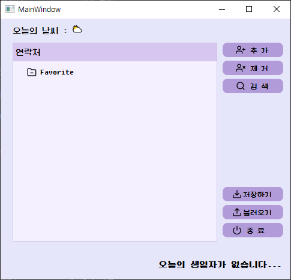

- 트리 뷰(TreeView)를 통해 연락처를 그룹/서브그룹 구조로 한눈에 확인
- 메인 화면 연락처는 그룹과 이름만 확인 가능
- 우측 상단에서는 데이터 추가/제거/검색
- 우측 하단에서는 저장하기/불러오기를 사용 가능
- 날씨 API 연동을 통해 현재 날씨 정보를 상단에서 실시간으로 표시
- 오늘의 날짜와 일치하는 생일자를 하단에 표시

---

### 데이터 추가

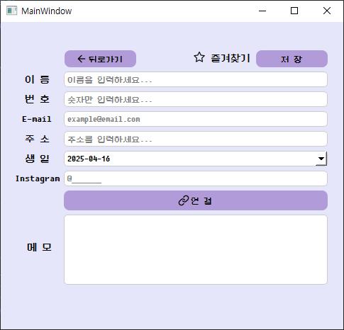

- 메뉴의 '추가' 버튼을 클릭하면 세부 페이지의 입력창이 나타남
- 연락처의 모든 정보를 입력 가능(이름, 번호, E-mail, 주소, 생일, SNS, 메모)
- SNS에 적인 정보를 통해 '연결' 버튼을 클릭하면 URL 자동으로 연결
- 새로 추가된 연락처는 즐겨찾기 여부에 따라 root 혹은 favorite 그룹에 배치

---

### 데이터 제거
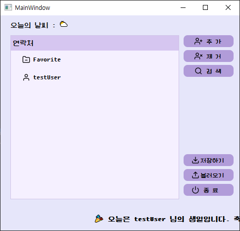

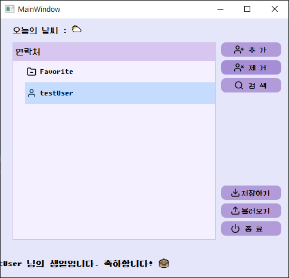

- 메인 화면의 트리 뷰(TreeView)에서 원하는 연락처를 선택한 뒤, '삭제' 버튼을 클릭하면 해당 연락처가 삭제
- 선택을 하지 않고 버튼을 클릭 시 확인 메세지 박스를 표시

---

### 데이터 검색


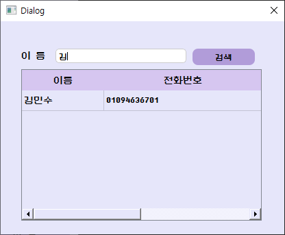

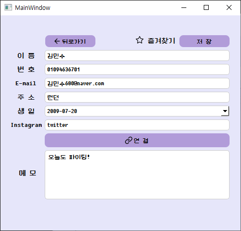

- 메인 화면에서 '검색' 버튼을 클릭하면 별도의 검색창이 나타남
- 검색창에 키워드를 입력하면 일치하는 연락처 리스트가 하단 테이블에 표시
- 문자 하나 입력해도 그 문자를 포함하는 모든 연락처 표시
- 하단 테이블에서 해당 연락처를 더블 클릭하면 해당 연락처의 세부 페이지로 전환
- 검색 결과는 동일 인물이 있을 경우, 구분할 수 있게 이름과 전화번호를 표시

---

### 데이터 수정

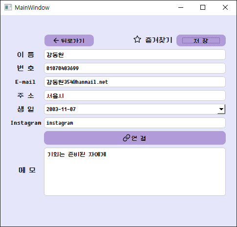

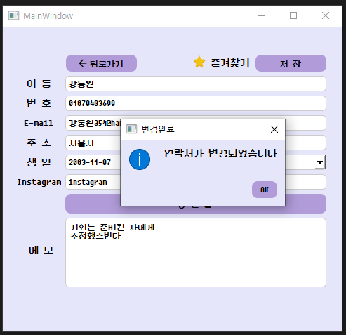

- 선택한 연락처의 세부 페이지에서 수정을 하고 '저장' 버튼을 클릭하면 변경 사항이 적용
- 메인 화면과 해당 연락처 세부 페이지가 변경된 것을 확인 가능

---

### 데이터 불러오기

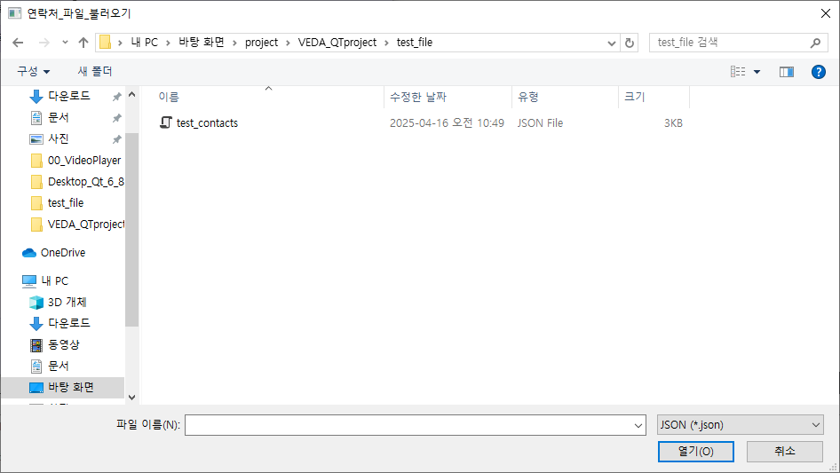

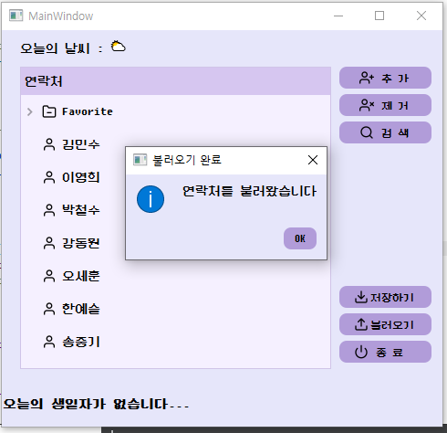

- JSON 파일로 저장된 연락처 데이터를 불러오기 가능
- 메뉴의 '불러오기' 버튼을 클릭한 후 JSON 파일을 선택하면 기존 데이터에 덮어쓰지 않고 불러온 파일 데이터로 갱신

---

### 데이터 저장하기

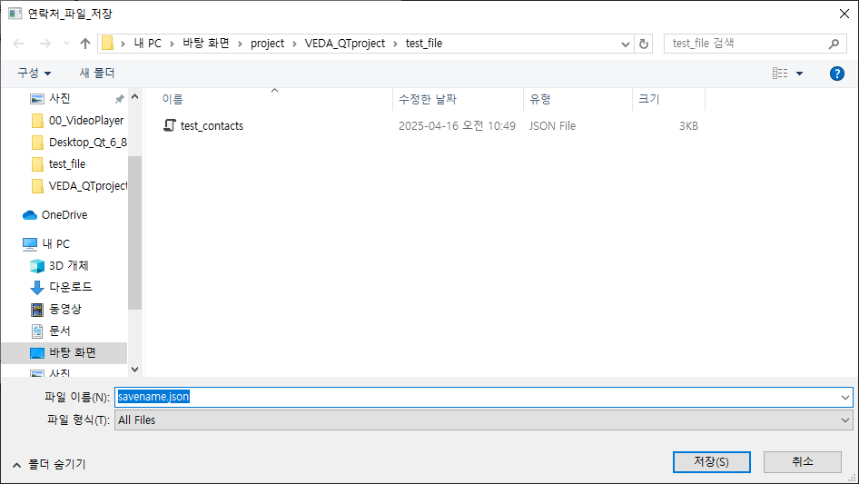

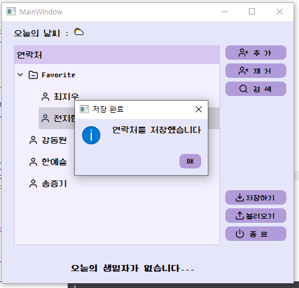

- 현재 메인 연락처에 등록된 모든 연락처 데이터를 JSON 형식으로 저장
- 저장 시에는 사용자에게 파일 경로를 묻고, 해당 경로에 JSON 파일이 생성

---

### 생일 알림

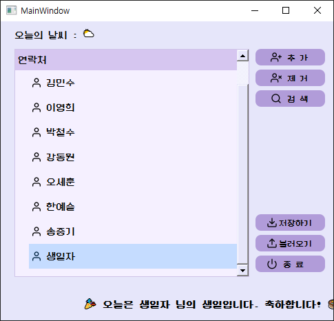

- 오늘의 날짜와 일치하는 생일자가 있을 시, 하단에 생일자 이름 표시
- 오늘의 날짜와 일치하는 생일자가 없을 시, 하단에 생일자가 없다고 표시
- 생일자 연락처 제거 시, 생일 알림도 같이 업데이트

## 소스코드 함수 간단 설명

### `ContactModel` 클래스

| 함수명 | 기능 설명 |
|--------|-----------|
| `ContactModel::ContactModel` | 루트 및 기본 그룹 초기화 (`ROOT`, `Favorite`) |
| `setBasicGroup()` | 트리 최상위 루트 및 즐겨찾기 그룹(Contact 객체) 구성 |
| `index()` | `QTreeView`가 요구하는 index 객체 반환 (트리 구조 구현) |
| `parent()` | 특정 index의 부모 인덱스를 반환 |
| `rowCount()` | 자식의 개수를 반환 |
| `columnCount()` | 열의 개수 반환 (고정: 1) |
| `data()` | index에 해당하는 연락처의 이름 또는 아이콘 반환 |
| `flags()` | 항목 선택 및 활성화 가능 설정 |
| `headerData()` | 헤더에 "연락처" 표시 설정 |
| `getList()` | 전체 연락처 리스트 (`allContacts`) 반환 |
| `getRoot()` | 루트 노드 반환 |
| `getFavorite()` | 즐겨찾기 그룹(Contact 객체) 반환 |
| `addContact(contact, parent)` | 부모에게 새 연락처를 추가하고 트리에 반영 |
| `removeContact(contact)` | 트리 및 전체 목록에서 연락처 제거 및 메모리 해제 |
| `clearAll()` | 모델 전체 초기화 후 루트와 기본 그룹 재설정 |
| `deleteTree(node)` | 트리 구조 순회하며 하위까지 메모리 삭제 |
| `toggleFavorite(contact)` | 연락처의 즐겨찾기 상태를 토글하여 위치를 ROOT/Favorite 그룹 간 이동 |
| `indexForContact(contact)` | 연락처 → QModelIndex 로 변환

---

### `Contact` 구조체

| 함수명 | 기능 설명 |
|--------|-----------|
| `childIndex(child)` | 자식 리스트에서 `child`의 인덱스를 반환 |
| `removeChild(child)` | 해당 자식을 리스트에서 제거하고 부모 참조 해제 |
| `insertChild(row, child)` | 특정 위치에 자식을 추가하고 부모 설정 |
| `setParent(parent)` | 부모 노드 설정 (역참조 연결)

---

### `SearchDialog` 클래스

| 함수명 | 기능 설명 |
|--------|-----------|
| `SearchDialog::SearchDialog` | UI 초기화, 검색 버튼과 더블클릭 이벤트 연결, 검색 모델 설정 및 테이블 설정 |
| `SetModelView()` | 검색 결과용 테이블 뷰에 모델을 연결하고 편집 불가능 및 행 번호 숨김 처리 |
| `SettableUi()` | 테이블 뷰 컬럼 너비 설정 및 리사이즈 모드를 고정으로 지정 |

### `mainwindow` 클래스

| 함수명 | 기능 설명 |
|--------|-----------|
| `MainWindow::MainWindow` | UI 초기화, 트리 모델 및 이벤트 연결, 검색/추가/삭제/저장/불러오기/날씨처리 등의 전체 로직 초기 구성 |
| `setLineEditProperty()` | 입력 필드의 유효성 검사 설정 (글자 수 제한, 숫자만 허용 등) 및 플레이스홀더 텍스트 설정 |
| `addNewContact()` | 입력 필드에 있는 정보를 기반으로 새 연락처를 생성하여 모델에 추가 |
| `editContact(contact)` | 주어진 `Contact` 객체의 속성값을 UI에서 입력된 내용으로 갱신 |
| `clearDetailWindow()` | 상세 정보 입력창(UI)을 초기 상태로 클리어 |
| `setDetailWindow(index)` | 선택된 연락처 정보를 UI에 채워넣음 (상세 페이지 전환 시 사용) |
| `slot_search()` | 검색창(`SearchDialog`) 실행 후 선택된 연락처를 상세페이지에 표시 |
| `saveToJson()` | 모든 연락처 정보를 JSON 형식으로 직렬화하여 파일로 저장 |
| `loadToJson()` | JSON 파일을 열어 연락처 정보를 역직렬화하여 트리 모델에 로드 |
| `updateBirthdayLabel()` | 오늘 생일인 연락처를 확인하여 배너에 텍스트로 표시 |
| `setBannerProperty()` | 배너 텍스트용 `QLabel`과 애니메이션 설정 초기화 |
| `startBannerAnimation()` | 배너 애니메이션 시작 위치 및 속도 설정 후 실행 |
| `setSystemStyle()` | 전체 위젯 스타일(QSS) 적용 및 아이콘/폰트 설정 | 

`MainWindow` 클래스 내에서 사용된 **람다 함수**

| 람다 위치 | 기능 설명 |
|-----------|-----------|
| `stackedWidget::currentChanged` | 페이지 인덱스가 `0`이면 생일 배너를 표시하고 애니메이션 시작, 다른 페이지면 배너 숨김 및 애니메이션 중지 |
| `pushButton_Add::clicked` | 상세 페이지로 전환하고 현재 선택된 연락처 초기화, 입력창 비우기 |
| `pushButton_Delete::clicked` | 선택된 연락처를 삭제. 선택 항목이 없거나 문제가 있으면 경고창 표시 |
| `treeView_PhoneBook::clicked` | 클릭한 항목의 `QModelIndex`를 `currentSelected`에 저장 |
| `treeView_PhoneBook::doubleClicked` | 더블클릭한 항목이 연락처(Contact)인 경우 상세페이지로 전환하고 내용을 표시 |
| `pushButton_Goback::clicked` | 상세 페이지에서 기본 페이지로 돌아감 |
| `pushButton_Save::clicked` | 이름이 입력되지 않았으면 경고, 새 연락처 생성 또는 기존 연락처 수정 후 페이지 전환 |
| `pushButton_SNS::clicked` | `lineEdit_SNS`의 텍스트를 기반으로 인스타그램 URL 열기 |
| `WeatherManager::dataReceived` | 날씨 문자열을 받아서 비어있지 않으면 라벨에 표시, 비어 있으면 공백 처리 |
| `SearchDialog::contactSelected` (in `slot_search`) | 검색창에서 선택된 연락처를 받아 상세 페이지에 표시하고 `currentSelected`, `currentDetailData`에 저장 |

---

### `WeatherManager` 클래스

- 프로그램 실행 시, 초기에 open Meteo API 를 활용하여 날씨정보를 받아 오늘의 날씨로 반영.

| 함수명 | 기능 설명 |
|--------|-----------|
| `WeatherManager::WeatherManager` | 날씨 API 호출 초기화, 응답 처리 람다 연결, 응답에서 날씨 코드 추출 후 텍스트 변환하여 `dataReceived()` 시그널 emit |
| `~WeatherManager()` | `QNetworkAccessManager` 자원 해제 |
| `weatherCodeToText(code)` | 날씨 코드(int)를 이모지 또는 간단한 설명 텍스트로 변환 |

---

## 문제점 및 해결방안

1. 즐겨찾기 상태에서 재 저장 시 Runtime Error 발생

해결 : 트리뷰에서 즐겨찾기 상태가 변경되면, root 그룹의 연락처 -> favorite 그룹으로 이동시키거나,
favorite -> root 로 이동해야하는 상황이 있었음.
이 때, Qt::unchecked, Qt::checked 와 같은 Qt 내부 enum type 값과 즐겨찾기 여부를 표시하기 위해 만든 
bool 타입 변수 값이 맞지 않아서 발생한 문제였음.
좀 더 명확히 if문의 조건을 즐겨찾기 값이 변했음을 확인하여 에러 해결.

2. 검색 창에서 검색결과를 더블클릭하여 상세 페이지 접근 후 저장 시 기존 연락처 수정이 아닌 중복되는 데이터로 추가 저장됨.

해결 : 기존 연락처로 상세페이지 접근 시 저장 버튼을 누르면 기존 연락처에 변경 저장하는 형태이면서,
새 연락처 저장으로 상세페이지 접근 시 저장 버튼을 통해 연락처 추가를 하게 했었음.
이 때 상세페이지로 진입할 때 어떤 연락처 정보를 선택했는지 멤버변수로 보유하게 하여 결정하도록 했는데,
검색 창으로 상세페이지 진입 시 연락처 정보를 저장하는 멤버변수의 업데이트가 이루어지지 않았음.
따라서, 검색 창으로 진입할 때 변수 업데이트를 진행하여 에러 해결.


## 소감

1. QTreeView에 대한 이해가 아직 부족하여, 기본적인 root 그룹과 즐겨찾기 favorite 그룹만 활용하여 프로젝트를 진행하였음. (별도의 그룹 데이터 다루기 않음)
-> 추후 다양한 그룹들을 이용할 수 있도록 업그레이드 하면 더 배울 수 있겠다고 생각함.

2. 어떤 타이밍에 어떤 슬롯이 호출 되는지를 파악하는데 시간이 걸렸음. 특히 시그널을 만들고 연결할 때 emit을 통해 값을 전달하는 구조가 어려웠음.
-> 다양한 위젯들과 상속받은 클래스의 함수들, 그리고 시그널/슬롯 연결 방식은 처음엔 낮설고 어려웠지만, 직접 문서를 참고해가며 구현해 보면서 구조를 이해를 할 수 있었음.
추후 사용하였던 함수들과 연결 방식을 이용하여 다른 프로젝트를 만들고자 함.
