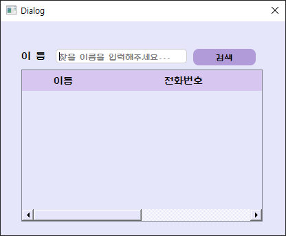

# VEDA_QTproject - 강한 연락처

VEDA 강시환 X 한영서의 연락처 프로젝트입니다.

Qt 6.8.3 기반 연락처 관리 애플리케이션으로, 연락처의 그룹/서브그룹 구조와 세부 정보를 트리 뷰로 시각화하고, JSON 파일로 데이터를 저장 및 불러올 수 있습니다. 
날씨 정보, SNS 프로필 연결 등 API 연동 기능도 일부 포함되어 있습니다.

## 주요 기능

- 연락처 트리뷰(QTreeView) 기반 관리
- 즐겨찾기 설정 기능
- 연락처 검색 대화상자(SearchDialog)
- 연락처 상세정보 패널(QStackedLayout)
- JSON을 통한 데이터 저장 및 불러오기
- 날씨 정보 표시 (외부리소스로 날씨 API를 활용 -> `WeatherManager`)
- SNS 링크 연결 (아이콘 및 URL)

## 빌드 방법

### 요구사항
- Qt 6.8.3
- CMake >= 3.15
- Windows 11

QT Creator를 활용하여 빌드하는 것을 추천합니다.

## 프로젝트 구조

```
makefile
복사
편집
VEDA_QTproject/
├── include/           # 헤더 파일
├── src/               # 구현 파일
├── ui/                # Qt Designer UI 파일
├── resources/         # 이미지 및 폰트 리소스
├── test_file/         # 테스트 JSON 데이터
├── CMakeLists.txt     # 빌드 스크립트
├── resources.qrc      # Qt 리소스 정의
└── README.md
```

## 프로젝트 상세 기능 소개

### 메인화면


### 데이터 추가


### 데이터 제거


### 데이터 검색




### 데이터 수정


### 데이터 불러오기


### 데이터 저장


### 생일자 알림


## 문제점

1.

2.

3.


## 소감

